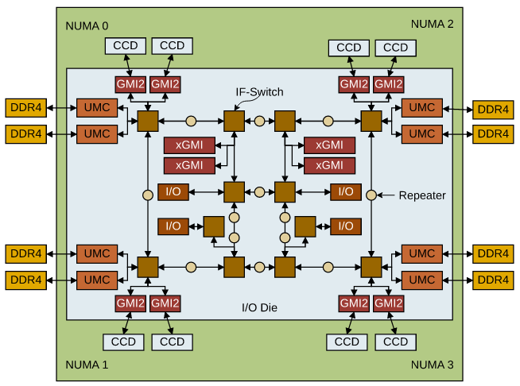
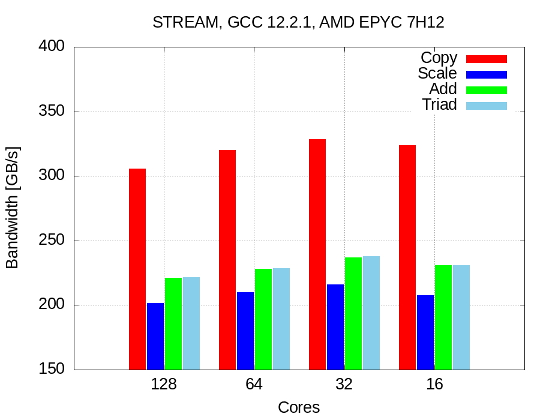
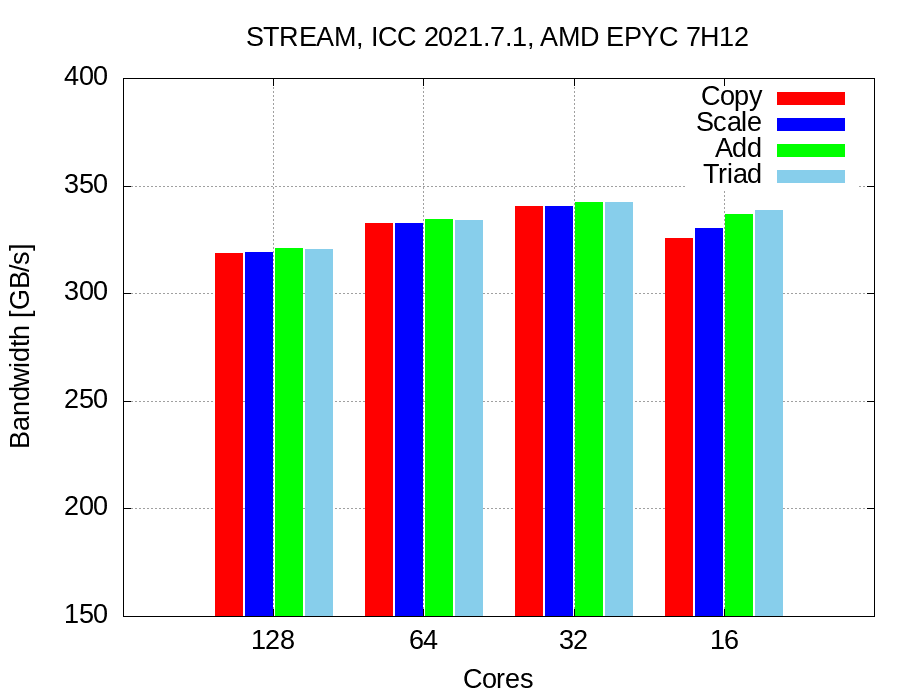

# Memory bandwith benchmarking with STREAM

## Preliminaries: inspect ORFEO EPYC hardware

This tutorial will dig into RAM performances of EPYC nodes.

Theoretical bandwidth peak performance can be calculated as follow:

$$ b_{peak}=\text{n° channels} \times f_{mem} \times 8Byte$$

AMD Epyc 7H12 processors have 8 memory channels and each channel is populated with `3200 MT/s` memory module. 
`MT/s` is the unit to measure the transfer per seconds, then this type of memory module can achieve  `3200` mega transfer per second (each transfer move 8 byte), the data rate would be `8 Byte x 3200 x 10^6` per second. Abouth `25.6 GB/s` for each RAM module.

Each socket with `8 memory channels` and one memory module for each channel can support in total `204.8 GB/s` of theretical bandwith. Since EPYC nodes are equipped with 2 sockets, the aggregated theoretical memory bandwidth is `409.6 GB/s` per node !

Take a look to a more detailed picture of AMD Rome.

I also suggest to take a look to <a href="https://arxiv.org/pdf/2204.03290.pdf">this detailed analys</a> from which the architecture picture is taken.



Each `DDR4` memory channel is attached to a `UMC` ( Unified Memory Controller)`. Each NUMA region (2 CCD each) is then served by 2 memory channels. Epyc nodes have 16 modules, 32 GB each, and all memory channels are populated (8 channel for each socket).

## Download and compile STREAM

Download STREAM `git clone https://github.com/jeffhammond/STREAM.git`

Some STREAM parameters can be defined at compile time, they are explained in `stream.c`, we will set them in the Makefile. 

First set `STREAM_ARRAY_SIZE` such that each of the 3 array are at least 4 times the size of the cache memory.
 Let's set the array size to `800000000` elements of double with the parameter `STREAM_TYPE`. The single array size will be: `6103.5 MiB`. 

And the caches size are:
```
[ntosato@epyc005 STREAM]$ lscpu
Architecture:            x86_64
  CPU op-mode(s):        32-bit, 64-bit
  Address sizes:         43 bits physical, 48 bits virtual
  Byte Order:            Little Endian
CPU(s):                  128
  On-line CPU(s) list:   0-127
Vendor ID:               AuthenticAMD
  Model name:            AMD EPYC 7H12 64-Core Processor
 
 <snip>

Caches (sum of all):     
  L1d:                   4 MiB (128 instances)
  L1i:                   4 MiB (128 instances)
  L2:                    64 MiB (128 instances)
  L3:                    512 MiB (32 instances)
```

Set also the parameter `NTIMES` to 100, each kernel will be executed `NTIMES` times and some statistics will be computed.

To run this test we will use also the Intel compiler `icc`, this compiles is available loading the `compiler module`: `module load compiler`.
 
Modify the Makefile as follow putting all settings in `CFLAGS`:

```
CFLAGS =  -DSTREAM_ARRAY_SIZE=800000000 -DNTIMES=100 -DSTERAM_TYPE=double -mcmodel=medium #-ffreestanding

all: stream_gcc.exe stream_icc.exe

stream_gcc.exe: stream.c
	gcc $(CFLAGS) stream.c -o stream_gcc.exe -fopenmp -O3 -ffast-math  -march=znver2  -mtune=znver2
clean:
	rm -f stream_gcc.exe stream_icc.exe *.o

stream_icc.exe: stream.c
	icc $(CFLAGS) stream.c -o stream_icc.exe -qopenmp -O3 -ffast-math
```

To compile is sufficient to type the command `make` (in the correct machine, **not** in the login node).

## First attemp:
Request an entire node and open a shell on it:
`srun -N1  --exclusive -p FHPC --time=1:0:0 --mem=50G --pty bash`

We have just request exclusively a node with bash shell on it. Since we are in the target machine, we can compile simply with `make`.

Running the executables *as is* with all 128 cores and without taking care of optimization and affinity the results are poor:

GCC results with 128 cores:

```
-------------------------------------------------------------
Function    Best Rate MB/s  Avg time     Min time     Max time
Copy:          305583.7     0.051800     0.041887     0.115514
Scale:         201266.7     0.072994     0.063597     0.121345
Add:           220611.3     0.099577     0.087031     0.186967
Triad:         221266.6     0.098168     0.086773     0.155643
-------------------------------------------------------------
```

ICC results with 128 cores:

```
-------------------------------------------------------------
Function    Best Rate MB/s  Avg time     Min time     Max time
Copy:          239804.1     0.061702     0.053377     0.092045
Scale:         224399.3     0.063547     0.057041     0.091968
Add:           220740.7     0.097838     0.086980     0.111698
Triad:         235779.2     0.092234     0.081432     0.116442
-------------------------------------------------------------
```

GCC shows good performances while copying, but as ICC is around `50%` of peak performance. *Note*: results are unstable and the gap between `Min time` and `Max time` is large.

As usual we are not happy with this results. 

## First improvement: OMP places

Set the places and bindings, now O.S is not allowed anymore to change places of waiting threads with the associated loss of cache and memory locality (this benchmark exploits the touch first policy). 
So we assume that data relative to each thread is stored in the nearest memory location and locality is kept. 


With the following options we are binding each thread to a physical core: 

```
export OMP_NUM_THREADS=128
export OMP_PLACES={0}:128:1
export OMP_DISPLAY_ENV=true
```

`OMP_DISPLAY_ENV=true` allows openMP to print to stderr all openMP settings and show usefull settings and default options. 
 

GCC results are not improved, even if they are more stable. 

```
-------------------------------------------------------------
Function    Best Rate MB/s  Avg time     Min time     Max time
Copy:          305533.3     0.042004     0.041894     0.042333
Scale:         201188.3     0.063866     0.063622     0.075561
Add:           220841.8     0.087066     0.086940     0.087954
Triad:         221233.8     0.086892     0.086786     0.087196
-------------------------------------------------------------
```


But ICC shows nice performances, about `78%` of peak performance:

```
-------------------------------------------------------------
Function    Best Rate MB/s  Avg time     Min time     Max time
Copy:          318835.4     0.040431     0.040146     0.043962
Scale:         319058.9     0.040326     0.040118     0.043022
Add:           320872.4     0.060125     0.059837     0.063124
Triad:         320508.5     0.060135     0.059905     0.063300
-------------------------------------------------------------
```

## Second improvement: reduce memory contention

Probably our cores are crunching numbers faster than memory can feed them, thus there is a memory contention.

Try to reduce the number of active cores.

### 64 cores:
Use 64 cores, and use only 2 cores for each CCX (remember that each CCX has 4 cores).

This placements can be achieved as follow:

```
export OMP_NUM_THREADS=64
export OMP_PLACES={0}:64:2 #64 places, stride 2
```

GCC improvements, it gain few GB/s of bandwidth:

```
-------------------------------------------------------------
Function    Best Rate MB/s  Avg time     Min time     Max time
Copy:          319704.9     0.040249     0.040037     0.047295
Scale:         209798.0     0.061180     0.061011     0.062501
Add:           228199.3     0.084424     0.084137     0.087142
Triad:         228620.4     0.084146     0.083982     0.085572
-------------------------------------------------------------
```

ICC improvements push the performance to `81%`:
```
-------------------------------------------------------------
Function    Best Rate MB/s  Avg time     Min time     Max time
Copy:          332466.9     0.038754     0.038500     0.043188
Scale:         332613.2     0.038793     0.038483     0.045081
Add:           334152.0     0.057686     0.057459     0.060967
Triad:         333924.8     0.057789     0.057498     0.062269
-------------------------------------------------------------

```

This small improvements suggest us that our guess was correct, try again to reduce the core number.

### 32 cores:
Set OMP environment:

```
export OMP_NUM_THREADS=32
export OMP_PLACES={0}:32:4 #32 places, stride 4
```
According to our places, we are using only one cores for each CCX. 
To display all places use this environment variables: `export OMP_DISPLAY_AFFINITY=true`. All threads places will be displayed and we are sure about our affinity:

```
level 1 thread 0x7fb3476cb7c0 affinity 0
level 1 thread 0x7fb3473ff640 affinity 4
level 1 thread 0x7fb346bfe640 affinity 8
level 1 thread 0x7fb3463fd640 affinity 12
level 1 thread 0x7fb345bfc640 affinity 16
level 1 thread 0x7fb3453fb640 affinity 20
...
...
...

```

Match this number with `lstopo` output to analyze your binding. 

GCC anyway still unsatisfactory and poor, even if there is a small improvement :
```
-------------------------------------------------------------
Function    Best Rate MB/s  Avg time     Min time     Max time
Copy:          328473.9     0.039776     0.038968     0.057798
Scale:         216117.7     0.059757     0.059227     0.068396
Add:           237191.8     0.081769     0.080947     0.093678
Triad:         237897.4     0.081688     0.080707     0.093343
-------------------------------------------------------------
```

But ICC performances are very nice ! 

**We are hitting about `84%` of peak performance**

```
-------------------------------------------------------------
Function    Best Rate MB/s  Avg time     Min time     Max time
Copy:          340524.5     0.038235     0.037589     0.052754
Scale:         340552.6     0.038549     0.037586     0.055205
Add:           342336.9     0.056750     0.056085     0.072600
Triad:         342514.5     0.056894     0.056056     0.072117
-------------------------------------------------------------

```


Reducing again the number of cores to 16 of course let to worse results: 
We are using only *half CCXs* and we are not exploiting all L3 caches: remember that each CCX has is own L3 cache! 


## Results summary:


