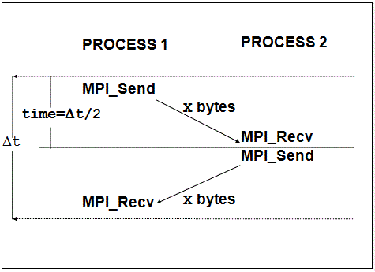
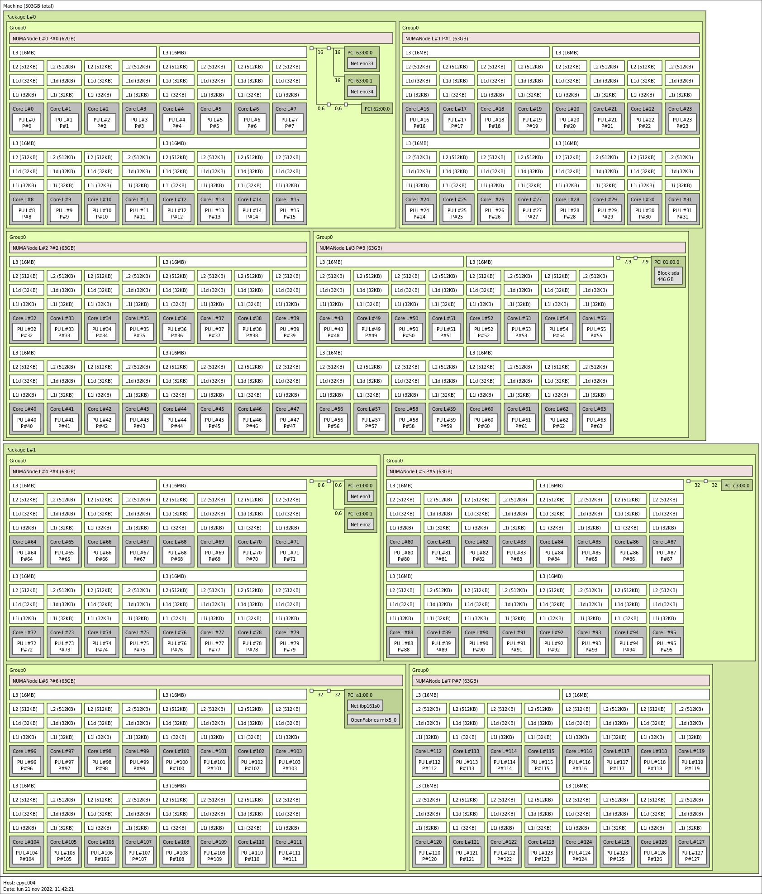
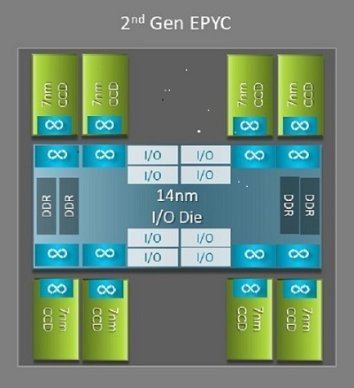
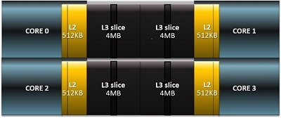
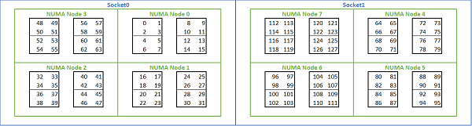

# Explore MPI communication 

This tutorial is going to show all available options to place mpi processes and to select different **BLT** and **PML**.

## Intel® MPI Benchmarks 

### Download

The Intel benchmark is the tool that we are going to use and explore.
First of all download it from official github <a href="https://github.com/intel/mpi-benchmarks"> repository </a>:

`git clone --branch IMB-v2021.3 https://github.com/intel/mpi-benchmarks.git`

And navigate to the correct folder:
`cd mpi-benchmarks/src_c`

### Compile

- Load the correct and suitable software stack for the target architecture. Then: 
`module load architecture/[AMD-Intel]` . All the experiments that follow are performed in AMD machine. 

- Load your favourite mpi implementation with yuor desired compiler: `module load openMPI/4.1.4/....`

- Allocate the resources for the benchmark: 2 cores for each node and 2 nodes: `salloc -N 2  --ntasks-per-node 2 -p FHPC --time=1:0:0`

And finally compile the software in the allocated machine:
`srun -n1 make`

If everything is went fine there must be present 5 executables:

- `IMB-MPI1`
- `IMB-EXT`
- `IMB-IO`
- `IMB-RMA`
- `IMB-NBC`


## Measure performance

In order to measure *latency* and *bandwidth* beetwen different places (**cores**,**sockets**,**nodes** and many other options) we need to bind process to the desired places, with `openMPI` the argument that to the trick is `--map-by`. 

From documentation:

```
--map-by <foo>
    Map to the specified object, defaults to socket. Supported options include slot, hwthread, core, L1cache, L2cache, L3cache, socket, numa, board, node, sequential, distance, and ppr ...
...

```


If `--map-by` is not specified the default behaviour is:

```
 Please note that mpirun automatically binds processes as of the start of the v1.8 series. Three binding patterns are used in the absence of any further directives:

Bind to core:
    when the number of processes is <= 2 
Bind to socket:
    when the number of processes is > 2 
Bind to none:
    when oversubscribed 
```

The performance will be measured using `IMB-MPI1` pingpong benchmark. 




### Map by core

Let's map all mpi processes in the same socket with `--map-by core`:

```
[ntosato@login02 src_c]$ mpirun -np 2 --map-by core ./IMB-MPI1 pingpong
#----------------------------------------------------------------
#    Intel(R) MPI Benchmarks 2018, MPI-1 part
#----------------------------------------------------------------
# Date                  : Mon Nov 21 11:28:46 2022
# Machine               : x86_64
# System                : Linux
# Release               : 5.19.13-200.fc36.x86_64
# Version               : #1 SMP PREEMPT_DYNAMIC Tue Oct 4 15:42:43 UTC 2022
# MPI Version           : 3.1
# MPI Thread Environment: 


# Calling sequence was: 

# ./IMB-MPI1 pingpong

# Minimum message length in bytes:   0
# Maximum message length in bytes:   4194304
#
# MPI_Datatype                   :   MPI_BYTE 
# MPI_Datatype for reductions    :   MPI_FLOAT
# MPI_Op                         :   MPI_SUM  
#

#

# List of Benchmarks to run:

# PingPong

#---------------------------------------------------
# Benchmarking PingPong 
# #processes = 2 
#---------------------------------------------------
       #bytes #repetitions      t[usec]   Mbytes/sec
            0         1000         0.15         0.00
            1         1000         0.14         6.95
            2         1000         0.15        13.68
            4         1000         0.14        28.17
            8         1000         0.14        55.97
           16         1000         0.17        95.43
           32         1000         0.15       220.52
           64         1000         0.15       440.28
          128         1000         0.19       674.68
          256         1000         0.19      1334.97
          512         1000         0.21      2479.39
         1024         1000         0.22      4605.93
         2048         1000         0.30      6930.18
         4096         1000         0.40     10225.02
         8192         1000         0.56     14720.87
        16384         1000         1.01     16236.54
        32768         1000         1.67     19583.06
        65536          640         2.97     22052.98
       131072          320         5.20     25187.35
       262144          160        24.28     10798.82
       524288           80        43.56     12034.72
      1048576           40        98.23     10674.20
      2097152           20       172.21     12177.67
      4194304           10       389.03     10781.55


```


The latency is very nice: `0.15 usec` !

### More on core mapping

Try now to select maually the cores by `ID`.

But first inspect the topology of the AMD machine.
Load `hwloc` tool and invoke `srun -n1 lstopo`, it will show the machine topology.



We can see that there are 8 NUMA regions, there are 4 of them for each socket (indicated as `Package`) and then some cores are closer to each other.

Try to use core `0` and core `1` with the command `mpirun -np 2 --cpu-list 0,1 ./IMB-MPI1 pingpong`, the result must be similar to the previous experiment. 

But using the core `0` and `4` the latency grows up to `0.34`. Note that core `0` and `4` are in the same NUMA region, but they don't share L3 cache.

```
[ntosato@login02 src_c]$ mpirun -np 2 --cpu-list 0,4 ./IMB-MPI1 pingpong
...
...
#---------------------------------------------------
# Benchmarking PingPong 
# #processes = 2 
#---------------------------------------------------
       #bytes #repetitions      t[usec]   Mbytes/sec
            0         1000         0.34         0.00
            1         1000         0.35         2.89
            2         1000         0.35         5.78
...

```

Try by yourself to use `--cpu-list` and see the latency between:

- core `0` and core `16`

- core `0` and core `32`


Latency keep growing beacause we are selecting cores that are far from each other. To inspec the distances use `numactl -H` and look at the distance matrix. 

```
[ntosato@login02 src_c]$ srun -n1 numactl -H
available: 8 nodes (0-7)
node 0 cpus: 0 1 2 3 4 5 6 7 8 9 10 11 12 13 14 15
node 0 size: 63926 MB
node 0 free: 60798 MB
node 1 cpus: 16 17 18 19 20 21 22 23 24 25 26 27 28 29 30 31
node 1 size: 64468 MB
node 1 free: 63068 MB
node 2 cpus: 32 33 34 35 36 37 38 39 40 41 42 43 44 45 46 47
node 2 size: 64506 MB
node 2 free: 62843 MB
node 3 cpus: 48 49 50 51 52 53 54 55 56 57 58 59 60 61 62 63
node 3 size: 64494 MB
node 3 free: 61913 MB
node 4 cpus: 64 65 66 67 68 69 70 71 72 73 74 75 76 77 78 79
node 4 size: 64506 MB
node 4 free: 62927 MB
node 5 cpus: 80 81 82 83 84 85 86 87 88 89 90 91 92 93 94 95
node 5 size: 64506 MB
node 5 free: 62825 MB
node 6 cpus: 96 97 98 99 100 101 102 103 104 105 106 107 108 109 110 111
node 6 size: 64506 MB
node 6 free: 62117 MB
node 7 cpus: 112 113 114 115 116 117 118 119 120 121 122 123 124 125 126 127
node 7 size: 64499 MB
node 7 free: 62288 MB
node distances:
node   0   1   2   3   4   5   6   7 
  0:  10  12  12  12  32  32  32  32 
  1:  12  10  12  12  32  32  32  32 
  2:  12  12  10  12  32  32  32  32 
  3:  12  12  12  10  32  32  32  32 
  4:  32  32  32  32  10  12  12  12 
  5:  32  32  32  32  12  10  12  12 
  6:  32  32  32  32  12  12  10  12 
  7:  32  32  32  32  12  12  12  10 

```


This complex output is due the AMD epyc Rome architecture. 

Each CPU has 64 cores organized in 8 different CCD (Core Complex Die), each couple of closest CCD represent a NUMA region. 




Each CCD contain 2 CCX (Core Complex) with 4 cores each, they share same L3 cache. 




Summing up all the infos: 





### Map by socket

We desire to map one process to each socket:

```
[ntosato@login02 src_c]$ mpirun -np 2 --map-by socket IMB-MPI1 pingpong
#----------------------------------------------------------------
#    Intel(R) MPI Benchmarks 2018, MPI-1 part
#----------------------------------------------------------------

...
...
...

# PingPong

#---------------------------------------------------
# Benchmarking PingPong 
# #processes = 2 
#---------------------------------------------------
       #bytes #repetitions      t[usec]   Mbytes/sec
            0         1000         0.69         0.00
            1         1000         0.69         1.44
            2         1000         0.69         2.89
            4         1000         0.71         5.62
            8         1000         0.69        11.63
           16         1000         0.69        23.27
           32         1000         0.91        35.08
...
...

```


The latency beetween 2 sockets is larger than the previous experiment.


### Map by node

When mapping by node we have to decide **PML**.

To explore **PML** select max message size up to 2^28 with `-mslog 28` and increase the number of repetitions to obtain more stable results with `-iter 10000`.

List all available `PML`s using ` srun ompi_info | grep pml` and select it:

` mpirun -np 2 --map-by node --mca pml [ucx|ob1|cm ... ] ./IMB-MPI1 pingpong -msglog 28 -iter 10000`

Explore by yourself all PMLs, you will discover that by default `openMPI` and `intelMPI` select `UCX`. 

All nodes are equipped with two 25 Gbit ethernet and one 100 Gbit Infiniband, try to discover the differences between the 2 devices using UCX pml.

To select a specific device UCX require the environment variable `UCX_NET_DEVICES` using openMPI options `-x UCX_NET_DEVICES=[my fast device]`. 

First list all available devices:

- You can use `ucx_info` : `srun -n1 ucx_info -d | grep Device` 

- Or you can trigger an error calling openMPI with a wrong device and let it suggest to you the correct available devices:

```
[ntosato@login02 src_c]$ mpirun -np 2 --map-by node --mca pml ucx -x UCX_NET_DEVICES=fake_device ./IMB-MPI1 pingpong

[1669031880.738755] [epyc005:588291:0]     ucp_context.c:969  UCX  WARN  network device 'fake_device' is not available, please use one or more of: 'bond0'(tcp), 'ibp161s0'(tcp), 'lo'(tcp), 'mlx5_0:1'(ib)

```

- `bond0` is the bond with ethernet card, it use TCP protocol.
- `ibp161s0` represent ip over Infiniband protocol that use Infiniband card with usual TCP socket.
- `mlx5_0:1` is the Infiniband Mellanox card that use Verbs instead of Socket 

And finally select the correct device:

```
[ntosato@login02 src_c]$ mpirun -np 2 --map-by node --mca pml ucx -x UCX_NET_DEVICES=mlx5_0:1 ./IMB-MPI1 pingpong
#----------------------------------------------------------------
#    Intel(R) MPI Benchmarks 2018, MPI-1 part
#----------------------------------------------------------------
# Date                  : Mon Nov 21 13:02:28 2022
# Machine               : x86_64
# System                : Linux
# Release               : 5.19.13-200.fc36.x86_64
# Version               : #1 SMP PREEMPT_DYNAMIC Tue Oct 4 15:42:43 UTC 2022
# MPI Version           : 3.1
# MPI Thread Environment: 


# Calling sequence was: 

# ./IMB-MPI1 pingpong

# Minimum message length in bytes:   0
# Maximum message length in bytes:   4194304
#
# MPI_Datatype                   :   MPI_BYTE 
# MPI_Datatype for reductions    :   MPI_FLOAT
# MPI_Op                         :   MPI_SUM  
#
#

# List of Benchmarks to run:

# PingPong

#---------------------------------------------------
# Benchmarking PingPong 
# #processes = 2 
#---------------------------------------------------
       #bytes #repetitions      t[usec]   Mbytes/sec
            0         1000         1.83         0.00
            1         1000         1.81         0.55
            2         1000         1.82         1.10
            4         1000         1.81         2.21
            8         1000         1.82         4.39
           16         1000         1.81         8.84
           32         1000         1.95        16.45
           64         1000         1.97        32.42
          128         1000         2.03        63.17
          256         1000         3.67        69.71
          512         1000         2.72       188.28
         1024         1000         2.88       354.96
         2048         1000         3.50       584.97
         4096         1000         4.34       944.39
         8192         1000         5.18      1580.68
        16384         1000         5.87      2788.96
        32768         1000         8.02      4083.34
        65536          640        11.60      5651.24
       131072          320        17.47      7503.69
       262144          160        28.77      9110.73
       524288           80        50.11     10462.14
      1048576           40        92.75     11305.50
      2097152           20       187.07     11210.56
      4194304           10       347.16     12081.72


# All processes entering MPI_Finalize

```

Try to experiment by yourself different protocols and devices. 

### More on node mapping

Can we achieve better performance when mapping process across different nodes?  Yes !

To achieve this result we need to write down a `rankfile`, a file that specify where we want to bind each rank (the single mpi worker).

- Find in which nodes resources are allocated:
```
[ntosato@login02 src_c]$ srun hostname
epyc005
epyc005
epyc004
epyc004
```


Write `myrankfile`, a simple text file to save:
```
rank 0=epyc004 slot=96-111
rank 1=epyc005 slot=96-111
```
This mean: spawn `rank 0` in `epyc004` machine and `rank 1` in `epyc005`,
bind the process to physical core set `[96-111]`. This core set is an entire NUMA region. 

Then run the benchmark:
```
[ntosato@login02 src_c]$ mpirun -np 2 --rankfile myrankfile --report-bindings ./IMB-MPI1 pingpong -msglog 28 -iter 10000
[epyc005:591374] MCW rank 1 bound to socket 1[core 104[hwt 0]]: [./././././././././././././././././././././././././././././././././././././././././././././././././././././././././././././././.][././././././././././././././././././././././././././././././././././././././././B/././././././././././././././././././././././.]
[epyc004:746060] MCW rank 0 bound to socket 1[core 104[hwt 0]]: [./././././././././././././././././././././././././././././././././././././././././././././././././././././././././././././././.][././././././././././././././././././././././././././././././././././././././././B/././././././././././././././././././././././.]
#----------------------------------------------------------------
#    Intel(R) MPI Benchmarks 2018, MPI-1 part
#----------------------------------------------------------------
# Date                  : Mon Nov 21 14:42:59 2022
# Machine               : x86_64
# System                : Linux
# Release               : 5.19.13-200.fc36.x86_64
# Version               : #1 SMP PREEMPT_DYNAMIC Tue Oct 4 15:42:43 UTC 2022
# MPI Version           : 3.1
# MPI Thread Environment: 


# Calling sequence was: 

# ./IMB-MPI1 pingpong -msglog 28 -iter 10000

# Minimum message length in bytes:   0
# Maximum message length in bytes:   268435456
#
# MPI_Datatype                   :   MPI_BYTE 
# MPI_Datatype for reductions    :   MPI_FLOAT
# MPI_Op                         :   MPI_SUM  n which
#
#

# List of Benchmarks to run:

# PingPong

#---------------------------------------------------
# Benchmarking PingPong 
# #processes = 2 
#---------------------------------------------------
       #bytes #repetitions      t[usec]   Mbytes/sec
            0        10000         1.60         0.00
            1        10000         1.59         0.63
            2        10000         1.59         1.26
            4        10000         1.60         2.51
            8        10000         1.60         5.01
           16        10000         1.60        10.01
           32        10000         1.68        19.07
           64        10000         1.76        36.41
          128        10000         1.80        71.27
          256        10000         2.20       116.55
          512        10000         2.35       217.51
         1024        10000         2.52       406.35
         2048        10000         3.09       662.15
         4096        10000         3.68      1113.35
         8192         5120         4.20      1952.22
        16384         2560         5.60      2926.00
        32768         1280         7.77      4214.77
        65536          640        10.80      6066.18
       131072          320        17.25      7597.46
       262144          160        28.39      9234.52
       524288           80        49.74     10541.01
      1048576           40        91.99     11398.50
      2097152           20       176.96     11850.83
      4194304           10       346.95     12089.23
      8388608            5       686.40     12221.15
     16777216            2      1365.14     12289.76
     33554432            1      2727.66     12301.56
     67108864            1      5445.08     12324.67
    134217728            1     10876.35     12340.33
    268435456            1     21745.45     12344.44


# All processes entering MPI_Finalize

```

Why the latency is lower and we gained `0.20 usec`? 

Beacause the PCI express port where the Infiniband adapter is plugged belong to the NUMA region with core `[96-111]`. You can verify that with `lstopo`. 
The mpi processes is then nearest as possible to the Infiniband card and the latency is lower.

